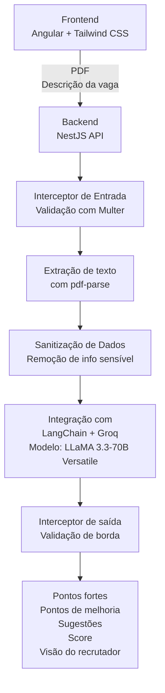

# 📄 Documentação do MVP – Assessment

## ✅ Objetivo
O MVP Assessment tem como objetivo validar a ideia de uma plataforma inteligente de análise de currículos, oferecendo:

- Score de compatibilidade entre o currículo e a vaga
- Match detalhado com base em habilidades, experiências e requisitos
- Análise semântica dos dados do currículo
- Interface amigável para visualização e envio dos dados

## 🔗 Repositórios
- **Frontend**: [https://github.com/Nizoszz/assessment-frontend](https://github.com/Nizoszz/assessment-chat-mvp-client/)
- **Backend**: [https://github.com/Nizoszz/assessment-backend](https://github.com/Nizoszz/assessment-mvp)

## 🧩 Arquitetura Geral

## 💻 Tecnologias Utilizadas

### Frontend
- **Angular** – Framework SPA para criação da interface do usuário
- **Tailwind CSS** – Utilizado para estilização rápida e responsiva
- **Chat Limitado**: O sistema de chat no frontend é limitado a interações estritamente relacionadas à análise do currículo e match com a vaga. Qualquer interação fora do escopo da análise será negada, garantindo que o foco do usuário seja na análise de compatibilidade e score, evitando distrações ou interações desnecessárias.

### Backend
- **NestJS** – Framework Node.js modular e escalável
- **Multer** – Manipulação de arquivos para upload do PDF
- **pdf-parse** – Extração de texto do currículo em PDF
- **Jest** - Teste de integração e e2e
- **LangChain** – Orquestração de fluxos com LLMs
- **Groq** – Infraestrutura para execução do modelo LLaMA
  - **Versão Trial**: Atualmente, o Groq está sendo utilizado na versão trial, que tem um limite diário de tokens para testes.
- **LLaMA 3.3-70B Versatile** – Modelo de linguagem para análise semântica
- **Interceptors NestJS**
  - **Entrada**: Validação e verificação de tipo/mimetype dos arquivos
  - **Saída**: Validação do score e estrutura de resposta
- **Sanitização de Dados Sensíveis**
  - Remoção automática de informações como CPF, e-mail, telefone, endereço

## 🔍 Funcionalidades-Chave
- 📤 **Upload de currículo em PDF**: O usuário envia seu currículo em formato PDF.
- 🔒 **Sanitização automática de dados sensíveis**: Todos os dados sensíveis (como CPF, e-mail, telefone, etc.) são removidos antes de qualquer processamento.
- 🧠 **Extração e análise semântica usando LLM**: O conteúdo do currículo é extraído e analisado semanticamente para identificar correspondências com os requisitos da vaga.
- 🎯 **Score de compatibilidade com a vaga**: O sistema gera um score que representa o quão compatível o currículo é com a vaga solicitada.
- ✅ **Retorno validado por interceptors**: Utilização de interceptors para validar dados de entrada e saída, garantindo que o sistema se comporte corretamente em diferentes cenários.

## 🧪 Objetivo de Validação do MVP
- **Viabilidade técnica**: Testar a integração entre upload, LLM e retorno estruturado.
- **Aderência do modelo**: Avaliar precisão do modelo LLaMA na análise semântica de currículos.
- **UX**: Validar experiência de usuário no processo de upload e resultado.
- **Foco na entrega de valor**: Validar a eficácia do sistema com interações mínimas e foco total na análise de compatibilidade com a vaga.

## 📌 Próximos Passos (Após Validação)
Após a validação do MVP, os próximos passos são:

1. **Integração com a plataforma de vagas em desenvolvimento**: O sistema será integrado a uma plataforma de vagas, com base em vagas existentes, para fornecer análise automatizada de currículos para diferentes ofertas de emprego.
2. **Transformação em chat real**: A plataforma será transformada em um chat real, permitindo interações dinâmicas e em tempo real entre o usuário e o sistema de análise.
3. **Implementação de Cache**: A implementação de cache para armazenar resultados de análises de currículos previamente processados, otimizando a performance e evitando reprocessamentos desnecessários.
4. **Rate Limiting**: O uso de rate limiting para limitar o número de avaliações de currículos dentro de um determinado período, garantindo que o sistema não seja sobrecarregado e que o uso de tokens seja gerenciado adequadamente.
5. **Aprimoramento contínuo**: Treinamento contínuo dos modelos com dados reais para melhorar a precisão da análise semântica e o score de compatibilidade.
